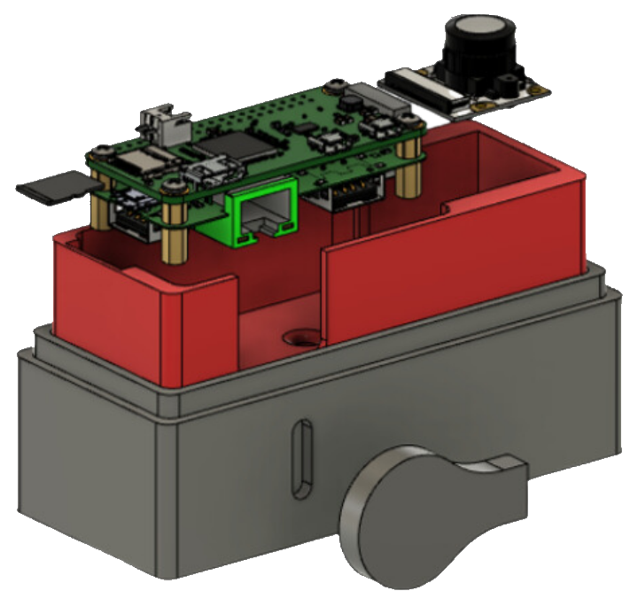

6/17/23 Version 1.0:

**Contributors:** Charlie Kim '25, Koen Miyashiro '25, James Randall '24

**Editors:** Koen Miyashiro '25, James Randall '24

**Approved by:** Tim Monroe '23

---

In 2022, Jesuit Robotics became the first MATE ROV competition participant to stream our ROV video feed live during the product demonstration. 
The positive feedback we received has inspired this repository: 
It contains all of Jesuit Robotics' documentation, designs, and code for the updated version of the digital camera modules that you saw last year.

[Here's](https://youtu.be/J15xGUYH15c) the footage of last year's product demo, if you want to check out what our cameras look like.

This documentation is intended to be read and understood by other highschoolers like us, but these cameras will be effective for any RANGER, PIONEER, or EXPLORER team. If you've got questions, reach out to randallj24@student.jhs.net. Feedback is always welcome, and we'll be pretty quick on any pull requests you've got for us.

ROVOTICS would like to open source most of / all of our designs and software in the future, and this is our first step.

*Exploded Camera CAD Model*

## What is in this repository?
There are 3 important documents:

* [build_guide.md](build_guide.md) includes the directions for building our camera modules.
* [camera_flash.md](camera_flash.md) is like a supplement to build_guide.md with directions for setting up the camera software.
* [structure.md](structure.md) explains the way that our camera software works and communicates with our camera viewer.

We've also got like all 4 lines of our code that run on these cameras. And the .step files for our camera housings are in the [cad_files](cad_files)
folder.
