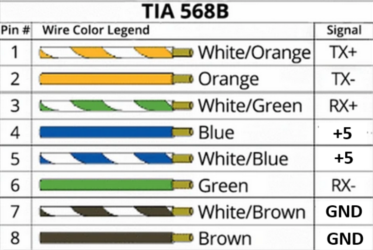
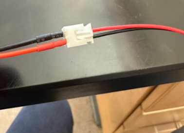
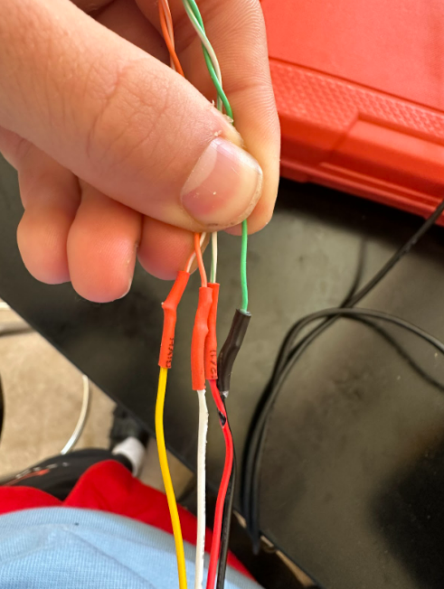
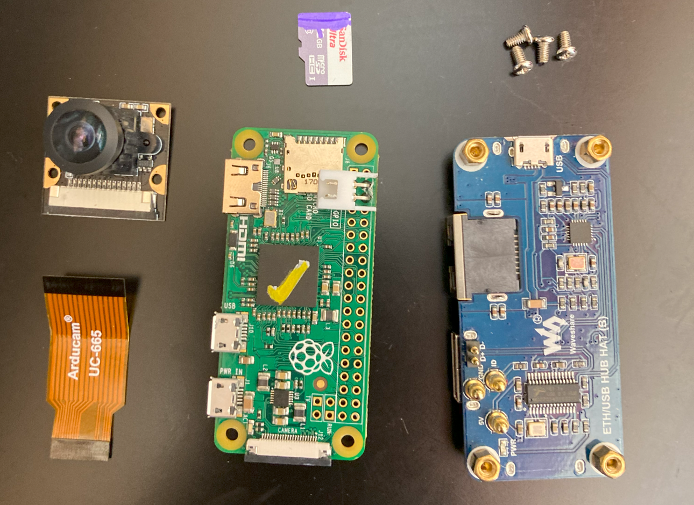
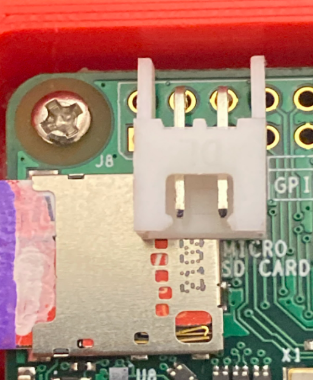
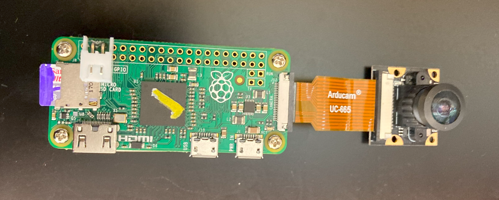
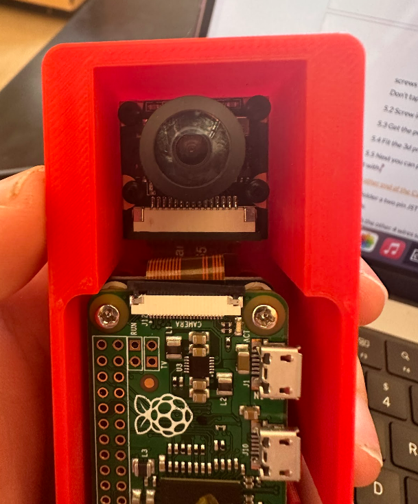

# Raspberry Pi Zero - Digital Camera Overview and Assembly Instructions 2023
This is the build guide for Jesuit High School's Raspberry Pi Cameras. It includes the required parts, and directions for assembly. This documentation was written entirely by new team members (Koen M and Charlie K), to ensure that no knowledge is taken for granted. Edited by James R, Koen M, and Charlie K.

These cameras do not run much in the way of software. They ping an IP address (The IP of your camera viewer, by default 192.168.1.100), and they stream camera feed to their own IPs on port 5000. A good camera viewer program listens for the pings and tunes in to those IPs. Jesuit will be open sourcing its camera viewer software in the near future, as an example.

For more software information, check out the included flowchart.

# BOM/Components:

Builds one camera. It's likely that you will already have most of these parts on hand.

## Electrical Components
* 1x [Raspberry PI-Zero](https://a.co/d/flye24Q)
* 1x [Pi Pogo board](https://a.co/d/cc47QEj)
* 1x [Raspberry Pi Camera V1](https://a.co/d/diPG2im)
* 1x [Raspberry Pi Camera Ribbon Cable (csi) UC- 665](https://www.digikey.com/en/products/detail/raspberry-pi/SC0004/12339168)
* 1x [Ethernet cables](https://a.co/d/dDdbl47)
* 1x [4 pin jst connectors](https://a.co/d/d0hVFJC)
* 1x [Right angle 2 pin jst adapter](https://a.co/d/c65l1uo)
* 1x [2 pin jst connectors](https://a.co/d/bHubkdF)
* 1x [Heatshrink](https://a.co/d/i5vroBO)

## Mechanical Components
* Camera Housing
  * 3-D Printed Casing
  * 3-D Printed Housing
  * 3-D Printed Lid
* [Denatured Alcohol](https://a.co/d/iLz6M4C)
* [Amazing Goop - Silicon Waterproof Sealant](https://a.co/d/d6aWSf7)
* [USB to JST 5v power plug](https://a.co/d/dwoa4uz)

## Software Components

* [Micro-SD Card (8gb+)](https://a.co/d/gpmyEPW)
* Device with micro-SD card interface
* [Router](https://a.co/d/cbSwPvk) (Any travel router will work fine)

## Tool Prep:

* [Ethernet Crimper](https://a.co/d/9HOIXPN) (RJ-45 Connectors included)
* [Flush Cutters](https://a.co/d/iD4LI89)
* [Solder and soldering iron](https://a.co/d/84wgCcV)
* Dremmel or file

# Build Guide:

1. [Modify ethernet cables](#Step1)
2. [Make the inner MEH ethernet cable.](#Step2)
3. [Make Pi setup](#Step3)
4. [Test the Pi setup](#Step4)
5. [Pot Pi setup](#Step5)
6. [Vaccum Test Units](#Step6)
7. [Make the other end of the Camera ethernet cable](#Step7)

***

##  1. Modify Ethernet Cables 

1.  Cut the ethernet cables in half

2.  On the terminated side (one with the plug) cut off the head so it is just cable. Strip about 2 inches off one end. 

3. Crimp stubby rj45 connector to all wires except for blue and brown pairs. **(Follow Guide)** The reason why we use the orange & green wires is because these wires are being used for Ethernet signals, and blue & brown are used for power and ground. We will use the blue & brown cables for  power later.

4.  Separate  out the blue and brown pairs.

5. Solder Blue pair to red and Brown pair to black of a 2 pin JST cable.*Make sure the JST wires are in the correct orientation because they sometimes are messed up.  *Try to use a 22 gauge wire JST but 26 gauge works too. *Also don’t forget to put on the heat shrink on wires before s soldering them together.  

6. Use the multimeter with a pointed object  and some alligator clips to test connectivity with the ethernet head. *The ethernet rj45 sometimes does not stick into the wires. Stick the other ends of the ethernet wires into a disassembled wall plug. 
   
## 2. Make the inner MEH ethernet cable. 

1. Take an ethernet cable and cut off about 6 in. 

2. Strip of about 1.5 in and separate off the blue and brown pairs. Crimp the other wires like the other end to a rj45 stubby or non-stubby. 

3.  Take off the housing on the ethernet cable and take out the blue/brown wire.*The housing just kept the wires together during crimping. 

4. Then solder the rest of the wires to a 4 pin JST male cable in order using the following guide. Make sure to use a heat shrink for strain relief on the rj45 and also put a heatshrink on each of the wires before you solder. (I always messed up on it. - Charlie K)
   

## 3. Make Pi setup 

1.  Solder right angle 2 pin JST connector to 5v and ground on the Raspberry Pi, OR, use a pigtail cable and solder it correctly to the Pi using the diagram below. Then use sticky tack to stick it to the pi. 

2. Connect the pogo board to the Pi zero with the standoffs. 

3. Plug the camera into the zero with the ribbon cable.

## 4. Test the Pi setup 

The following steps will differ greatly depending on your setup. The directions we have included below are specific to Jesuit's use cases. The gist is that we are obtaining the IP address of the camera, and testing the software through an ssh instance.

1. Plug the Ethernet to Ethernet cable into your Pi (the blue board on the bottom of the Pi Zero), and then plug in power through the 90 degree 2-pin JST connector, using the JST to USB Power Connector. 

2. Connect the other end of the ethernet to your router. Visit the router page (192.168.1.1 for most routers), and find the IP address of the camera.

3. The camera should now be streaming video to port 5000 on that IP address. Test that you can view this video with your camera viewer software. If you want to check out our implementation, see THIS REPOSITORY (ADD LATER BOZO)

4. Cut power to the camera once it has been tested.

## 5. Pot Pi setup 

1.  Screw the camera in first with m2 0.4mm by 8-12mm long nylon screws. Make sure to find the right sized screw driver as the screws are easy to strip. If they do not screw in well you may have to tap it. Don't tap completely through the standoffs as they can break. 

2. Tap the 3d print to screw in the pi. 

3. Screw in the Pi next and fit the 3d printed housing. 

4. Drill a hole in the pvc with a dremmel or file.

5. Clean it with denatured alcohol to remove sharp edges and make it look clean.

6. Thread the modified cable through the pvc and plug it into the Pi setup, i.e. the JST connectors and the ethernet hub.

7. Fit the 3d printed case inside the pvc. Be careful of knotted wires and damaging them.

8. Use glue to close the gap in the hole. Use pvc cement to attach a turret to the outer pvc, fitted around the ethernet and power wires. 

9.  Clean a lens with an exacto knife.

10. Sandpaper the edge lightly.

11. Use goop to seal the lens to the housing. Before adding goop use tape to cover the case. As you are adding goop use a q-tip to make sure the goop gets in the crack. It helps remove airbubbles. Smooth it with a popsicle stick and make sure there are no air bubbles or holes. Work quickly as it dries fast. 

12. Next you can put the penetrator on the wire about 8 inches up and glue it with goop/clear silicone.

## 6. Vacuum Test the Pi setups 

1. Fill a bucket with water. Make sure that all camera electronics are entirely powered off.
   
2. Then put the camera into a bucket of water and weight it down. Wait at least 20 minutes.
   
3. Remove the cameras from the bucket. Perform a visual inspection and look for water. If there is no water in the camera, it's good.

## 7. Make the other end of the Camera ethernet cable 

1. Solder a two pin JST male adapter the same way that it was soldered on the other side (i.e. power to power, and ethernet to ethernet. Check this using a multimeter). 
2. With the other 4 wires solder a 4 pin jst pin male in the same order as the power JST cable from section 1.

# DONE!